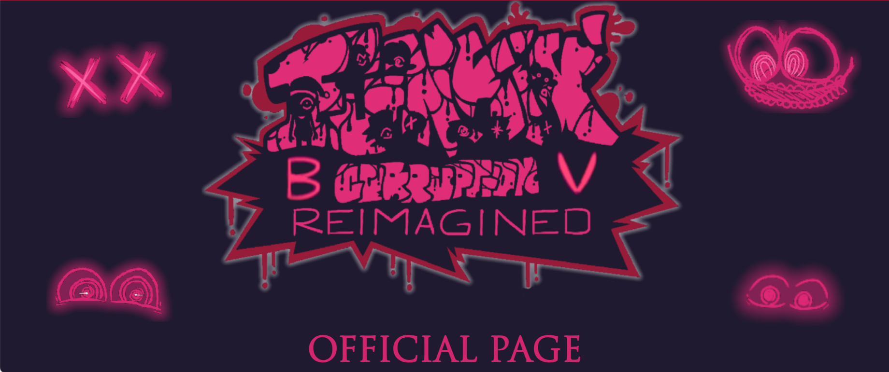
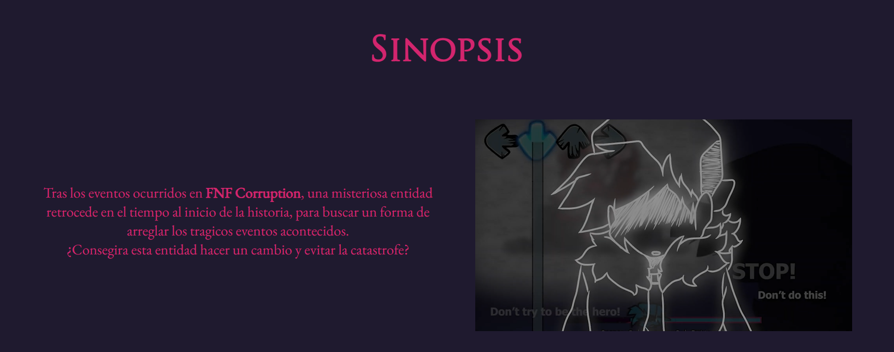
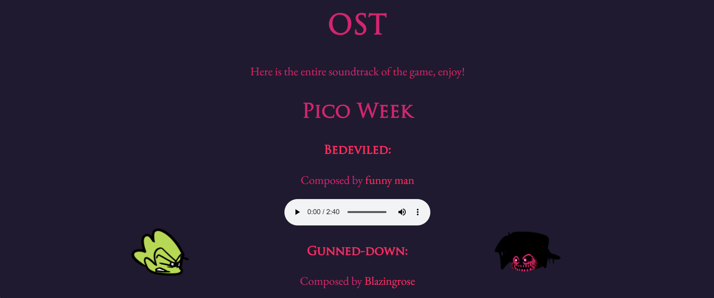
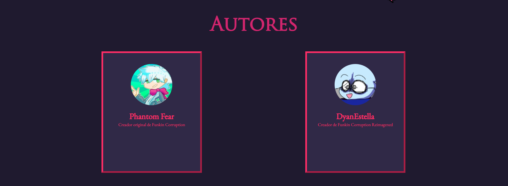
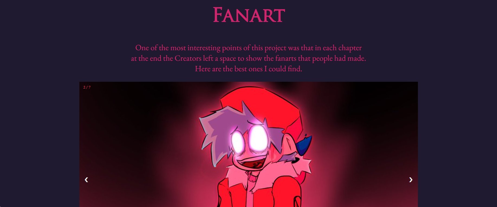
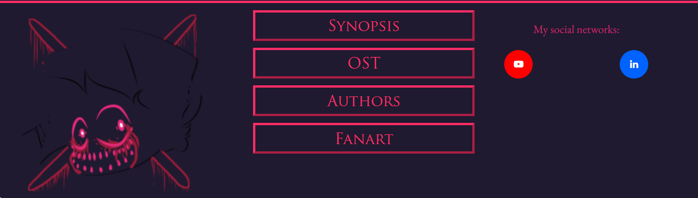

<h1>Memoria del proyecto fin de evaluación de Lenguajes de Marcas - 1º DAW</h1>
<h2>CRBV - Official Website</h2>
<h2>Indice</h2>
<ul>
  <li><a href="#introduccion">Introducción</a></li>
  <li><a href="#motivacion">Motivación</a></li>
  <li><a href="#estructura">Estructura</a></li>
  <li><a href="#estilo">Estilo</a></li>
</ul>

<h2 id="introduccion">Introducción</h2>

Trabajo realizado por: Miguel Ángel Ávila Rosas

Proyecto de web "from scratch" de 1ª evaluación de Lenguajes de Marcas

Diciembre de 2023 

Licencia CC-BY

<h2 id="motivacion">Motivación</h2>

El tema elejido proviene de un proyecto que realice en verano, se trataba de coger un "Mod" de un juego 
popular y modificarlo para que quedara como a mi me gustaba, añadiendo eventos, cambiando imagenes, etc...

<h2 id="estructura">Estructura</h2>

La web está dividida en 6 secciones:

<ul>
  <li>Hero Section</li>
  <li>Sinopsis</li>  
  <li>OST (Soundtrack del juego)</li>
  <li>Autores</li>
  <li>FanArt (Galeria)</li>
  <li>Footer</li>
</ul>

<h3>Hero Section</h3>

La sección Hero esta compuesta por varias imagenes sacadas de los archivos del Mod, todas las imagenes 
pertenecen a <a href="https://www.youtube.com/@DyanEstella" target="_blank">DyanEstella</a>, el autor original del Mod, un poco mas abajo se encuentra un boton de descarga para descargar el mod y probarlo por ti mismo.

<h3>Sinopsis</h3>

La sinopsis habla un poco sobre la historia principal del juego, acompañada del trailer del mismo al lado 
para dar contexto, el triler, de nuevo, fue sacado del canal de <a href="https://www.youtube.com/@DyanEstella" target="_blank">DyanEstella</a>.

<h3>OST (Soundtrack del juego)</h3>

Esta sección contiene el Soundtrack de todo el juego, sacado de los 5 compositores que hicieron el juego:

<ul>
  <li><a href="https://www.youtube.com/@funnymanisfunny" target="_blank">funny man</a></li>
  <li><a href="https://www.youtube.com/@blazingrose_5624" target="_blank">ImThatBlueWolf</a></li>  
  <li><a href="https://www.youtube.com/@buttercakeee" target="_blank">buttercakeee</a></li>
  <li><a href="https://www.youtube.com/@ValorGenesect" target="_blank">ValorGenesect</a></li>
  <li><a href="https://www.youtube.com/@therealjojo8878" target="_blank">TheRealJojo</a></li>
</ul>

<h3>Autores</h3>

En esta sección se encuentran cards de el creador del mod de corrupción, <a href="https://www.youtube.com/@PhantomFearYT" target="_blank">Phantom Fear</a>, y el creador original de Funkin Corruption Reimagened, <a href="https://www.youtube.com/@DyanEstella" target="_blank">DyanEstella</a>, con sus enlaces a youtube correspondientes clicando en su imagen de perfil. El snippet de las cards apareceran al final del "readme".

<h3>FanArt</h3>

En esta ultima sección, he decidido poner muchos de los mejores "FanArts" del mod, todos estos tienen un nivel 
   de esfuerzo extraordinario y por eso creo que merecen una aparición.

<h3>Footer</h3>

<h2 id="estilo">Estilo de la página</h2>
<h3>Paleta de colores</h3>

.....

<h3>Tipografías</h3>

.....

<h3>Imágenes</h3>

.....

<h3>Videos</h3>

.....

...................
<h2 id="snippets">Code snippets</h2>

He utilizado los siguientes:

<ul>
  <li>Barra de navegación: tomada de w3Schools "How to" (poner vínculo)</li>
  <li>Accordion: ..............</li>
  <li>..........</li>
</ul>
